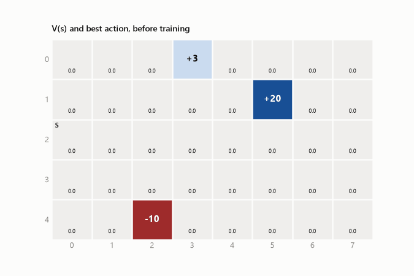
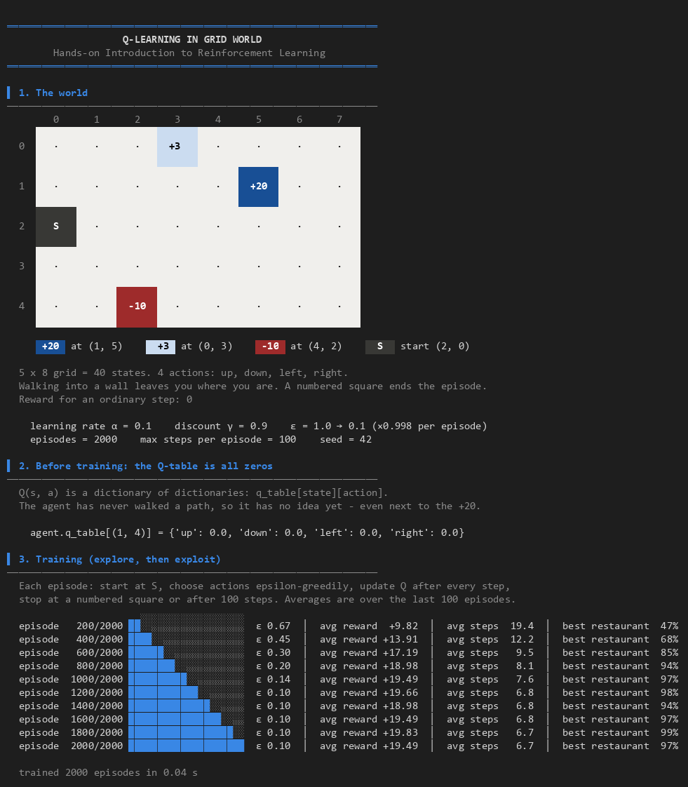
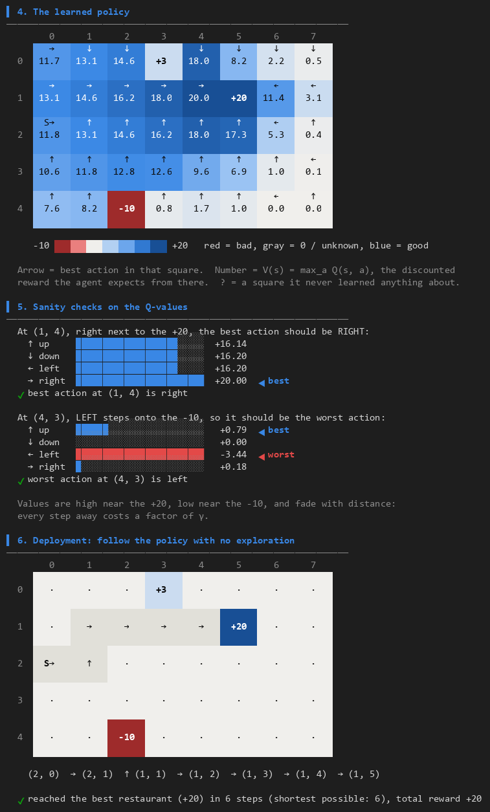
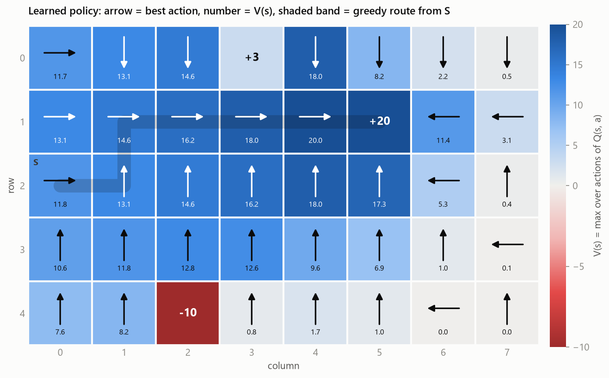
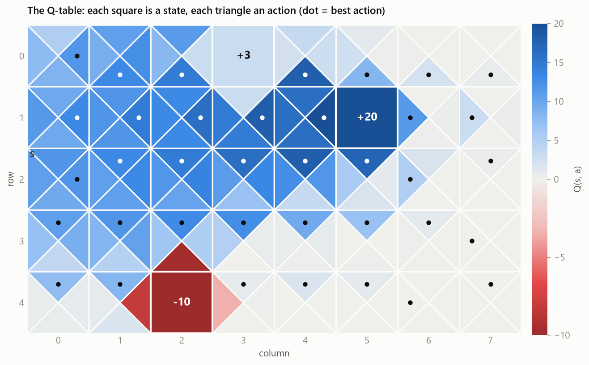
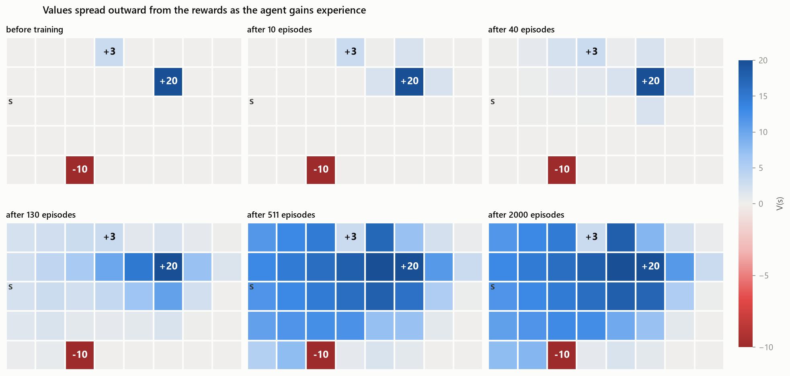
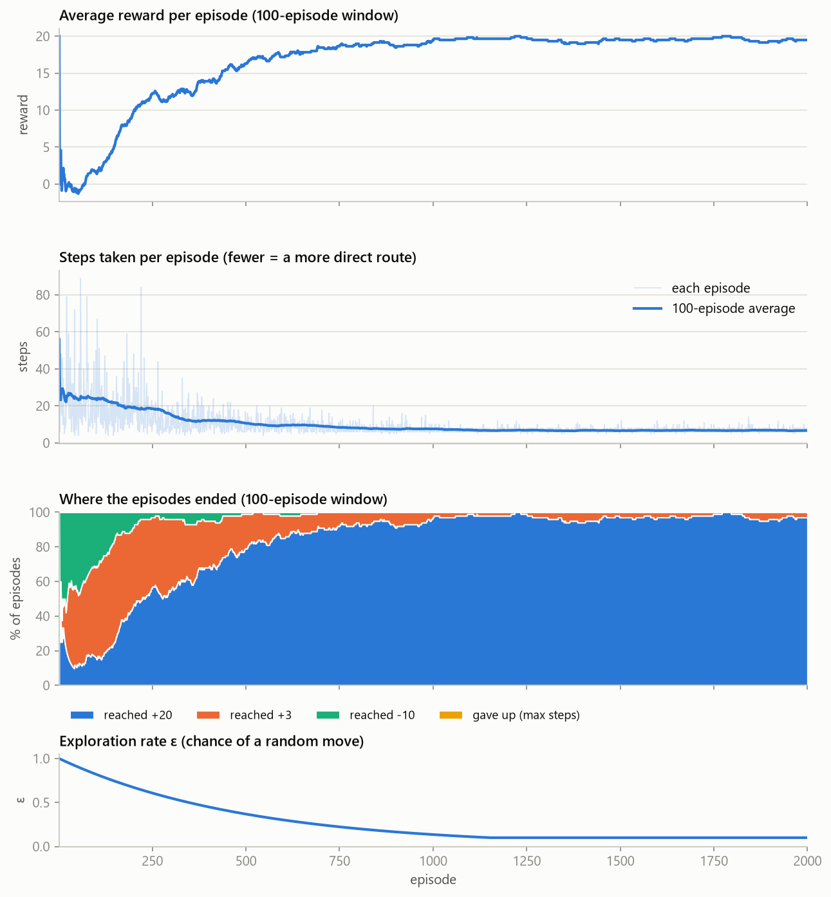

# Q-Learning in Grid World

A small, readable implementation of **Q-learning** on the 5 × 8 "grid world" from the guest lecture
*Hands-on Introduction to Reinforcement Learning*. An agent starts at home, knows nothing about the
town, and learns from experience alone where the best restaurant is and how to get there.

The core (environment, agent, training loop) uses only Python's `random` module. NumPy and
matplotlib are used for the charts and the animation.

<p align="center">
  
</p>

---

## The problem

```
        col  0    1    2    3    4    5    6    7
  row 0      .    .    .   +3    .    .    .    .
  row 1      .    .    .    .    .  +20    .    .
  row 2      S    .    .    .    .    .    .    .
  row 3      .    .    .    .    .    .    .    .
  row 4      .    .  -10    .    .    .    .    .
```

- **40 states**: each square is a `(row, col)` tuple, zero-indexed.
- **4 actions**: `up`, `down`, `left`, `right`, one square at a time. Walking into a wall leaves you where you are.
- **3 restaurants (terminal states)**: `+20` (the best), `+3` (okay) and `-10` (terrible). Stepping on one ends the episode.
- **Start** at `S = (2, 0)`, "your house". Every episode (every "day") starts here again.
- Every other step gives a reward of `0` by default.

The agent has to discover that `+20` exists, that it beats `+3`, that `-10` should be avoided, and
which route gets to `+20` fastest. Nobody gives it the map.

## Quick start

You need **Python 3.9+**.

```bash
git clone https://github.com/VinayakMokashi/gridworld-q-learning.git
cd gridworld-q-learning
pip install -r requirements.txt
python main.py
```

(On Windows, `py main.py` works if `python` isn't on your PATH. If you prefer a virtual
environment, create and activate one before the `pip install`.)

Training itself takes a fraction of a second. Saving the figures and the GIF takes another 10–20 seconds.

### Handy variations

```bash
python main.py --animate          # watch the trained agent walk to the restaurant
python main.py --show             # also open the figures in windows
python main.py --no-plots         # terminal output only
python main.py --help             # every option
```

## What you'll see

The terminal output follows the order of the lecture:

1. **The world**: the map, the rewards and the settings.
2. **Before training**: `agent.q_table[(1, 4)]` is all zeros. The agent has never been anywhere.
3. **Training**: a progress line every 10% of the run, showing the average reward, the average number of steps and how often the agent reaches the best restaurant.
4. **The learned policy**: the best action in every square, coloured by how valuable the square is.
5. **The lecture's intuition, checked**: at `(1, 4)` the best action is `right` (onto the +20); at `(4, 3)` the worst action is `left` (onto the −10).
6. **Deployment**: the agent follows its policy with no exploration and reaches `+20` in the shortest possible 6 steps.
7. **Saved outputs**: the figures below plus `q_table.csv`.

<p align="center">
  
  
</p>

Colours are switched off automatically when the output isn't a terminal (or when `NO_COLOR` is set).
Force them with `--color always` or `--color never`.

### Figures (saved in `outputs/`)

| File | What it shows |
|------|---------------|
| `value_policy.png` | Value of each square, V(s), with the best action as an arrow and the greedy route from S |
| `q_table.png` | The whole Q-table: each square split into four triangles, one per action |
| `value_snapshots.png` | V(s) at six points in training: value spreads outward from the rewards |
| `value_propagation.gif` | The same spreading as an animation, with the policy forming |
| `training_curves.png` | Average reward, steps per episode, where episodes ended, and the exploration rate ε |
| `q_table.csv` | Every Q(s, a) as numbers, plus the best action and V(s) for each square |

<p align="center">
  
  
</p>
<p align="center">
  
</p>
<p align="center">
  
</p>

## How it works

### The pieces, and where they live

| Lecture idea | In this code |
|---|---|
| **State** *s*, a square on the grid | `(row, col)` tuple: [`gridworld.py`](gridworld.py) |
| **Action** *a*, one of four moves | `env.actions`, `env.action_effects` |
| **Environment**: knows where you are and hands out rewards | `GridWorld.reset()`, `GridWorld.step(action) -> (next_state, reward, done)` |
| **Q-table** *Q(s, a)*, a dictionary of dictionaries | `agent.q_table[state][action]`: [`agent.py`](agent.py) |
| **Explore vs. exploit** (the restaurant story) | `agent.choose_action()`, ε-greedy |
| **Best known action** | `agent.get_best_action()` |
| **The update**: the one line that does all the learning | `agent.update_q_table()` |
| **Episodes and steps**: one day of walking, then start again | `train_agent()`: [`train.py`](train.py) |
| **Deployment**: just follow the highest Q-value | `greedy_rollout()` |

### The training loop

```python
for episode in range(num_episodes):            # every day...
    state = env.reset()                        # ...leave the house
    for step in range(max_steps_per_episode):
        action = agent.choose_action(state)    # explore (random) or exploit (best known)
        next_state, reward, done = env.step(action)
        agent.update_q_table(state, action, reward, next_state, done)
        state = next_state
        if done:                               # reached a restaurant: done for the day
            break
    agent.decay_epsilon()                      # explore a little less tomorrow
```

### The math, in one place

The **return** is the total discounted reward from now on, and it is recursive:

$$G_t = R_t + \gamma R_{t+1} + \gamma^2 R_{t+2} + \dots = R_t + \gamma\, G_{t+1}$$

The **Q-function** is the expected return if you are in state *s*, take action *a*, and act well afterwards.
The optimal one satisfies the **Bellman optimality equation**:

$$Q^*(s,a) = R(s,a) + \gamma \max_{a'} Q^*(s',a')$$

Early in training the two sides don't match. Doing gradient descent on the squared difference (the
*Bellman error*), with the right-hand side treated as a fixed target, gives the **Q-learning update**:

$$Q(s,a) \leftarrow Q(s,a) + \alpha \Big[\, r + \gamma \max_{a'} Q(s',a') - Q(s,a) \,\Big]$$

That is exactly `update_q_table`:

```python
best_next_q = 0.0 if done else max(self.q_table[next_state].values())
td_target = reward + self.discount_factor * best_next_q
td_error = td_target - self.q_table[state][action]
self.q_table[state][action] += self.learning_rate * td_error
```

Repeat it enough and the values spread out from the rewards. Squares near `+20` become high, squares
near `-10` become low, and each step further away shrinks the value by a factor of γ. Once the
table is learned, the policy is simply "take the action with the highest Q-value".

### One change from the lecture: ε starts high and decays

The lecture used ε = 0.1 (explore 10% of the time). With ε fixed at 0.1 from the very first episode, the
agent often stumbles onto the nearby `+3` restaurant first and keeps going back to it, never exploring
far enough to find the `+20`. In a test over 100 random seeds (2000 episodes each), that happened in 61 of them.
That is the explore-vs-exploit dilemma in action.

So by default ε starts at **1.0** (new in town, try everything) and shrinks by ×0.998 each episode down
to the lecture's **0.1**. With that schedule, the learning rate α = 0.1, γ = 0.9 and 2000 episodes, the
agent found the optimal 6-step route in 100 out of 100 seeds.

You can still run the lecture's exact setting (see below).

## Experiments to try

| Try this | What happens |
|---|---|
| `python main.py --epsilon 0.1 --epsilon-decay 1 --seed 2` | Fixed ε = 0.1, as in the lecture. The agent settles for the `+3` restaurant. |
| `python main.py --step-reward -1 --gamma 1` | Every step costs 1, so the agent is rewarded for the **shortest** route even without discounting. |
| `python main.py --start 4 7` | Start from the bottom-right corner instead. |
| `python main.py --gamma 0.5` | A short-sighted agent: far-away rewards are almost worthless, so the values fade quickly. |
| `python main.py --episodes 100` | Too little experience: look for `?` squares the agent never learned about. |
| `python main.py --animate` | Watch the trained agent walk, one step at a time. |

**Exercise from the lecture:** allow diagonal moves. Add `"up_left": (-1, -1)` and the three other
diagonals to `action_effects` and `actions` in [`gridworld.py`](gridworld.py), plus arrows for them in
`ARROWS` ([`terminal_view.py`](terminal_view.py)) and `ARROW_OFFSETS` ([`plots.py`](plots.py)). How many
steps does the best route take now?

## Command-line options

| Option | Default | Meaning |
|---|---|---|
| `--episodes` | 2000 | Number of training episodes |
| `--max-steps` | 100 | Give up on an episode after this many steps |
| `--alpha` | 0.1 | Learning rate α |
| `--gamma` | 0.9 | Discount factor γ |
| `--epsilon` | 1.0 | Starting exploration rate ε |
| `--epsilon-decay` | 0.998 | Multiply ε by this after each episode (`1` = never decay) |
| `--min-epsilon` | 0.1 | ε never goes below this |
| `--start ROW COL` | 2 0 | Start square |
| `--step-reward` | 0 | Reward for each ordinary step (try `-1`) |
| `--seed` | 42 | Random seed, so runs are repeatable |
| `--out` | `outputs` | Where to save figures and `q_table.csv` |
| `--no-plots` | off | Skip the matplotlib figures |
| `--show` | off | Also open the figures in windows |
| `--animate` | off | Replay the learned route step by step in the terminal |
| `--color` | `auto` | `auto`, `always` or `never` |

## Project structure

```
gridworld-q-learning/
├── main.py            # run this: the whole story, end to end
├── gridworld.py       # the environment: grid, rewards, step() and reset()
├── agent.py           # the Q-learning agent: Q-table, epsilon-greedy, the update
├── train.py           # the training loop and the greedy deployment walk
├── terminal_view.py   # coloured maps, Q-value bars, progress lines, animation
├── plots.py           # matplotlib figures and the GIF
├── palette.py         # colours shared by the terminal and the figures
├── tests/             # pytest tests for the environment, the agent and training
└── assets/            # the sample figures shown in this README
```

## Running the tests

```bash
pip install pytest
python -m pytest
```

The tests check the environment rules (walls, terminal rewards), the exact arithmetic of the Q-update,
the ε decay, and that training finds the 6-step route to `+20`.
